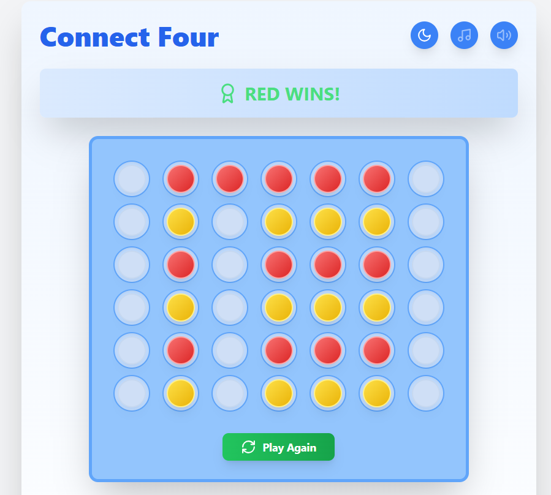
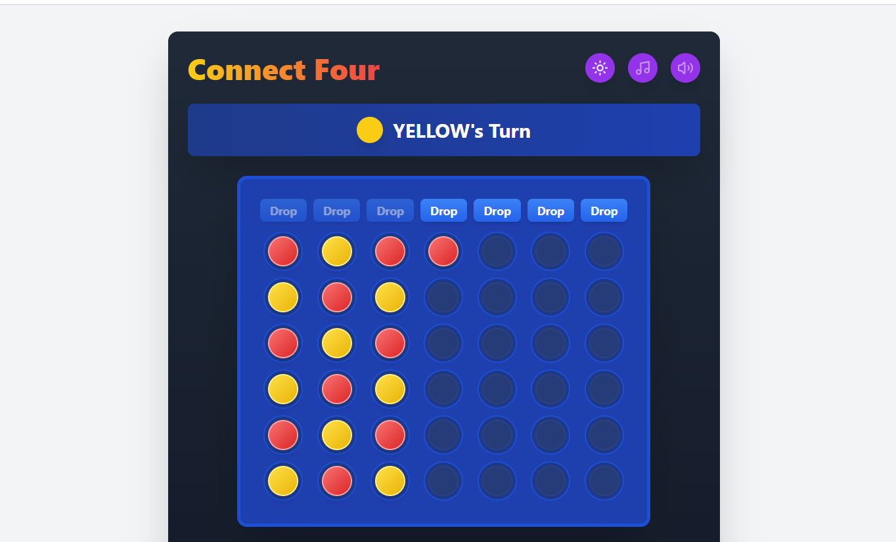

# Connect Four Game

## Overview
This project is a web-based implementation of the classic Connect Four game. It allows two players to take turns dropping tokens into a 7x6 grid until one player achieves four in a row (horizontally, vertically, or diagonally) or the board fills up, resulting in a draw. The game includes sound effects, background music, and a theme toggle (dark/light mode) for an enhanced user experience.

## Features
- **Two-player gameplay**: Players take turns dropping red and yellow tokens into the board.
- **Winner detection**: The game checks for horizontal, vertical, and diagonal four-in-a-row victories.
- **Draw detection**: If the board fills up without a winner, the game declares a draw.
- **Sound effects & music**: Includes sounds for token drops, wins, and draws, along with background music.
- **Dark & light mode**: Players can toggle between dark and light themes for better visual experience.
- **Restart functionality**: Players can reset the game at any time.

## Project Structure
```
cconnect-four/
├── src/
│   ├── components/
│   │   └── ConnectFour.jsx  # Main game component
│   ├── utils/
│   │   └── connectFourUtils.js  # Utility functions for game logic
│   ├── App.jsx  # Main app file
│   ├── main.jsx  # Vite entry point
│   ├── index.css
├── public/
│   ├── sounds/
│   │   ├── drop.mp3
│   │   ├── win.mp3
│   │   ├── draw.mp3
│   │   └── background-music.mp3
│   ├── favicon.ico
│   ├── vite.svg
│   └── index.html
├── package.json
├── vite.config.js  # Vite configuration file
├── README.md

```

## Installation & Setup
1. **Clone the repository**:
   ```sh
   git clone https://github.com/hanithakkar887/connect-four.git
   ```
2. **Navigate to the project directory**:
   ```sh
   cd connect-four
   ```
3. **Install dependencies**:
   ```sh
   npm install
   ```
4. **Start the development server**:
   ```sh
   npm run dev
   ```


## Usage
1. Click on a column to drop a token.
2. Players take turns placing tokens until a winner is declared or the game results in a draw.
3. Use the **Restart** button to reset the game at any time.
4. Toggle sound effects, background music, and dark mode using the available buttons.

## Utility Functions (`connectFourUtils.js`)
- **`checkForWinner(board)`**: Scans the board for a winner or a draw and returns the result.
- **`deepClone(obj)`**: Creates a deep copy of the board to maintain immutability.

## Technologies Used
- React.js (for UI components)
- JavaScript (game logic)
- CSS (styling, dark/light mode)
- Lucide-react (icons)
- HTML5 (structure)

## Future Enhancements
- Add AI opponent for single-player mode.
- Implement animations for smoother gameplay.
- Enhance UI with more visual effects.
- Deploy the game online for public access.

## Deployed Link
Check out the live version here: [https://connect-four-3d-v2.vercel.app/)


## Screenshot




## 📸 Screenshot
(
)
## 📸 Screenshot
(
)
## 📸 Screenshot
(
)

